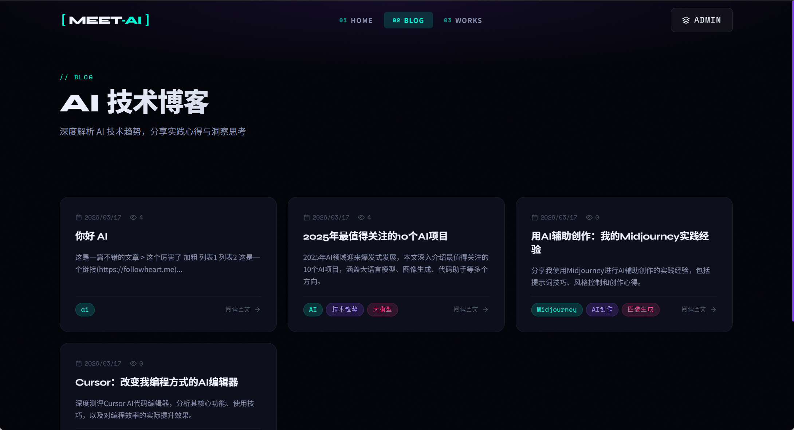
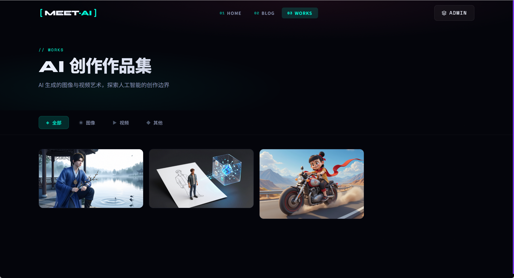
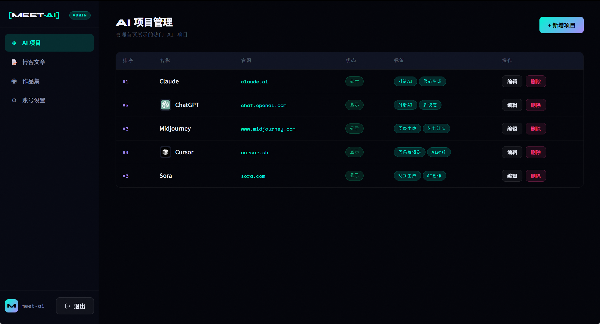

# 个人网站（全栈应用）

这是一个小型全栈应用，包含首页、博客和作品集三个板块，以及对应的管理端。\
同时，数据库使用SQLite，匹配小型站点定位。\
作品展示支持图像和视频，上传后存放于当前服务中。

## 站点预览





## 服务启动

```bash
sh ./start.sh
```
或
```cmd
# session 1
cd backend & npm install
npm start

# session 2
cd frontend & npm install
npm run dev
```

## 后台管理
初始用户：meet-ai/admin123
